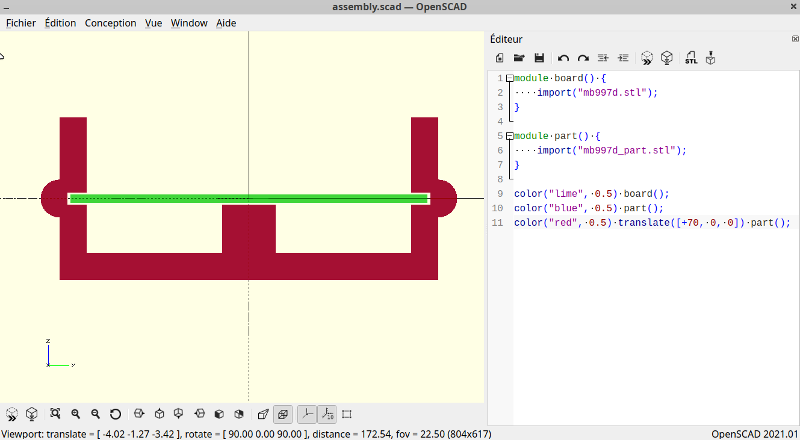
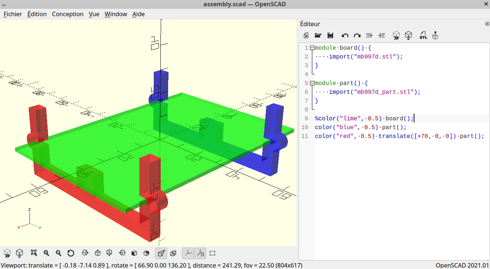
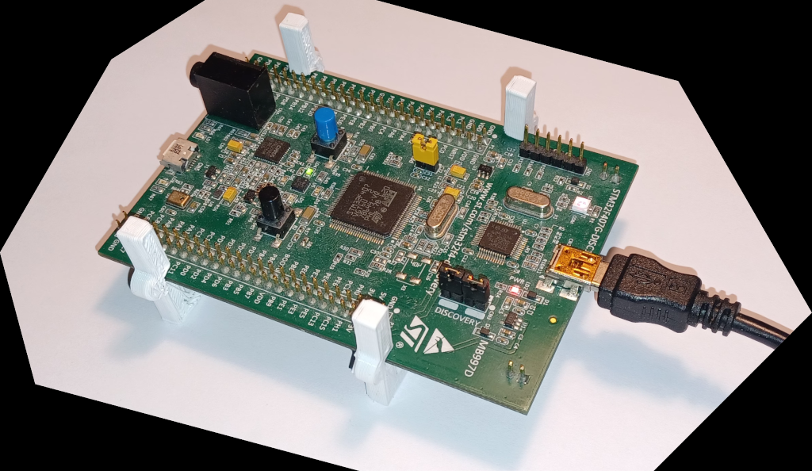
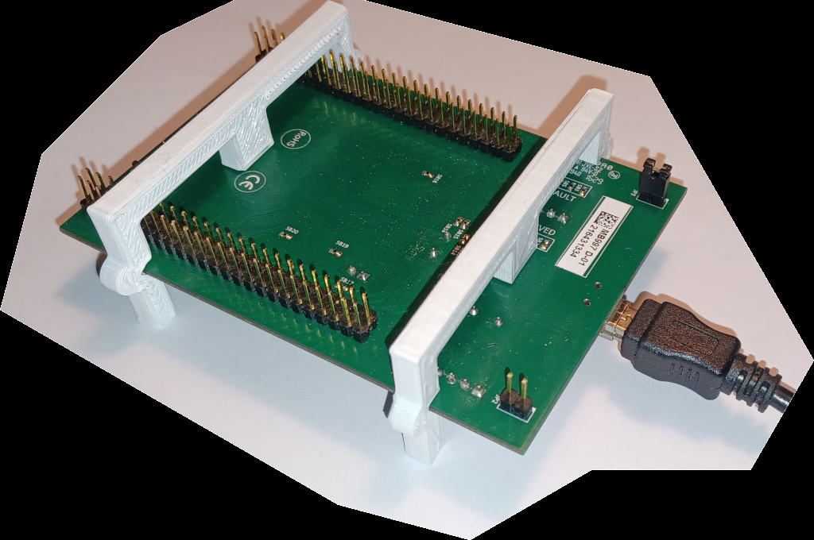

# mb997d_part
support part for mb997d board

## Advantages
> fast to design 
> cheap to print 
> portable 

## Offsets

mb997d stm32f4-discovery board size dimensions in mm : 
> width = 66 
> length = 97 
> thickness = 1.6 
> tolerance = 0.5 

  

color legend for screenshots: 
> board -- red 
> part.s -- gold 

## Assembly

  

## Result

3d print with white PLA 1.75 mm and 10% fill 
> top side 

  

 

> bottom side  

  

 

## License

This project is licensed under the BSD 3-Clause License - see the LICENSE
file for details.

Copyright (c) 2026 alexander14k28@gmail.com

See [LICENSE](LICENSE) for the license governing this project.
